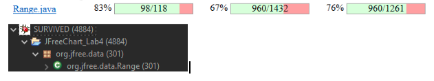
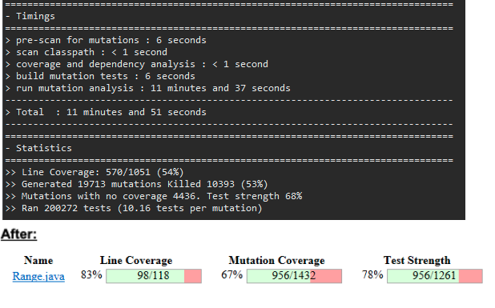
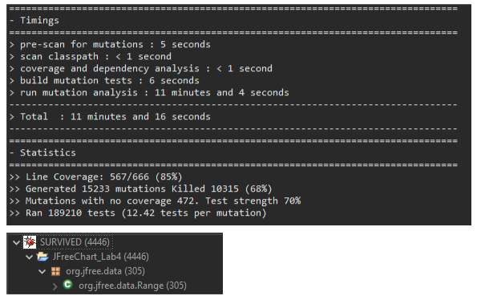
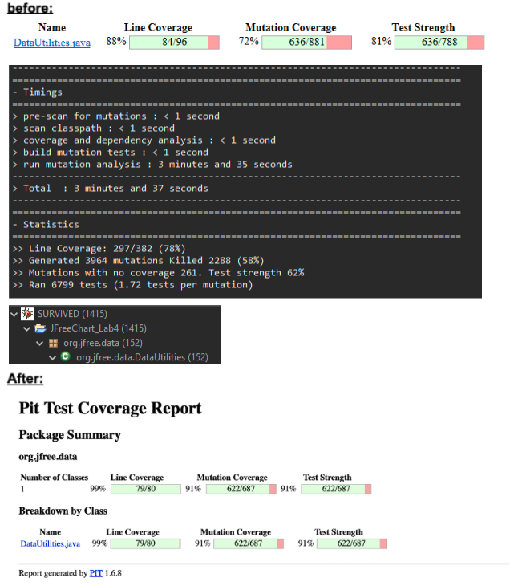
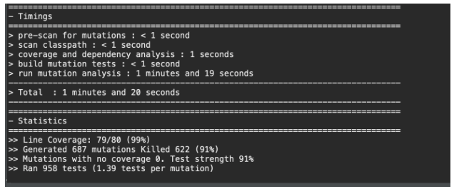

**SENG 438 - Software Testing, Reliability, and Quality**

**Lab. Report \#4 – Mutation Testing and Web app testing**

| Group \#:      |  16   |
| -------------- | --- |
| Student Names: |     |
|  Ethan Winters              |     |
|  Carter Marcelo              |     |
|  Jason Pang		|     |
|  Karim Mansour            |     |

# Introduction
In this lab report, the design, implementation and execution of various mutation tests will be done. You will also find the creation and execution of web-based tests using the selenium IDE. These tests showcase robust and unique ways to test software and how these tools can be used to further deepen one’s understanding of the software.

# Analysis of 10 Mutants of the Range class 
1) Incremented (a++) double local variable
This mutation caused the output of the Range exception message to be Incremented by 1. This mutation was killed because our test suite makes sure the exception message is correct.

2) Removed conditional - replaced comparison check with false
This mutation survived as it replaced the condition lower > upper with false causing the program to not check if the Range sent in was correct or not causing it to not be killed.

3) Substituted 2.0 with 0.0
This mutation was killed as it replaced one of the variables from what it should be as we make sure to calculate what the data should return it was killed because it returned the incorrect data
4) Greater or equal to equal
This mutation was killed as it changed the conditional statement and created something that shouldn’t happen causing our sut to catch the difference and kill the mutation
5) Substituted 0 with -1
Our sut doesn’t cover this mutation causing it to survive and not be caught by the test class
6) Line 451: equal to less or equal
This causes the if statement to fail allowing the mutation to survive as it turns out to be true still because of the equals 
7) Line 482: substitute 32 with 33
This mutation survives as shifting the number by 32 or 33 for both runs makes the sut still get the same answer causing the mutation to survive
8) mutated return of Object value for org/jfree/data/Range::combineIgnoringNaN to ( if (x != null) null else throw new RuntimeException ) → KILLED
This creates a fake throw runtimeexception that get caught by the sut and kills the mutation
9) Line 271: mutated return of Object value for org/jfree/data/Range::combineIgnoringNaN to ( if (x != null) null else throw new RuntimeException ) → NO_COVERAGE
Our sure doesn’t expect runtimeExpections during this line causing the mutation to survive
10) Line 246: replaced call to java/lang/Math::max with argument → KILLED
This causes the method to return the incorrect bounds and results which is caught my the sut and terminated

# Report all the statistics and the mutation score for each test class

Stats for RangeTest:
It must be noted that we didn’t increase the RangeTest coverage by 10% and only by 2%. It had an initial mutation coverage that was 76%, which means our coverage was already pretty good. Despite numerous additional test cases, we didn't reach 10% and could only increase it to 78%. Mostly because the remaining mutations are equivalent mutations, and random number generating mutations which are impossible to kill as they do not affect test cases.
Before updating it:

Stats for DataUtilities:

# Analysis drawn on the effectiveness of each of the test classes

For the RangeTest class it was not as effective as predicted. Our line and mutation coverage stayed the same before and after completing the tests. The line coverage was at 83% and mutation coverage was at 67%. Our strength tests did increase, but the increase was from 76% to 78%. Although with ample additional tests we were unable to increase the line or mutation coverage, this is due to the remaining mutations being equivalent mutations, and random number generating mutations which are impossible to kill.

However for our DataUtilities tests we did see an increase in coverage. Line coverage went from 88% up to 99%, Mutation coverage went from 72% to 91%, and Test Strength went 81% to 91%. This shows that our DataUtilities tests created were extremely effective. 

# A discussion on the effect of equivalent mutants on mutation score accuracy

Equivalent mutants are mutations that have similar behavior as the original code. Additionally equivalent mutants do not create any new errors making them harder to detect. If the equivalent mutants are not detected then the mutation score will have a significant lower accuracy. This is why equivalent mutants must be considered in the final mutation score to improve the accuracy. 

# A discussion of what could have been done to improve the mutation score of the test suites

There are few things that could have been done to improve the mutation score. Firstly looking more in-depthly in the mutation log and summary, this would allow us to find the root of the mutation and create tests that would kill them. This would have taken more time but would have allowed us to achieve a higher mutation score. Secondly would be writing more tests on top of being more in depth with the mutation log, as the increase of tests that can eliminate mutants the better the mutation score will become. 

# Why do we need mutation testing? Advantages and disadvantages of mutation testing

Mutation testing helps check the quality of the test cases of a test suite. Mutation testing allows coverage for full coverage of the code, this ensures parts of the code is detected including parts that are not tested properly, hidden faults, and program mutants. Although Mutation testing has really strong coverage it does have downsides. These downsides include costs, the cost of time and monetary. It takes a large amount of money and a large amount of time running due to the mutant programs being generated independently. 

# Explain your SELENUIM test case design process

For the process of designing the tests, it was important to examine all the key features that a user may be interacting with while using the system. This ensures that the full functionality is covered for the system. Tests were then fit with assertions and waits to ensure they run properly and don’t fail due to the page not loading correctly for example. The tests performed on IKEA.com have shown no sources of defects or errors, which is mostly expected given the traffic and national daily usage this website receives. 

# Explain the use of assertions and checkpoints

These verifications and assertions are used to ensure the test worked as expected without having to visually inspect the results on the webpage. They also can be used to test things that cannot be seen on the webpage, such as whether or not buttons are clickable unless a certain field is full. These are the backbone of the tests, as they are what truly determines if the test worked or not. In the findSpareParts test for example, assertions are used to make sure parts can be found and that nothing gets selected when searching for a part that doesn’t exist.

# how did you test each functionaity with different test data

To test the functionality with different data, pre-set ups were used for some tests. An example of this is the deleteFromCart test, which was tested with both an item in the cart and an empty cart. These preset conditions are hardcoded into the tests to be set up before they run. 

# Discuss advantages and disadvantages of Selenium vs. Sikulix

The use of the recording function in Selenium proves a high advantage to save time instead of writing code while Skulix only allows for code to be written. Selenium allows for the output of test files in various test formats, such as PyTest, which is useful for fast-drafting tests that can then be added to later. The downside to Selenium however is how it’s strictly based on a web-based IDE which only allows for drag and drop commands, removing the option for a collaborative IDE. However, there is the option to export a project as a .side file, making it easy to upload to GitHub for external collaboration. 

# How the team work/effort was divided and managed

While all the team members did contribute to both part 1 and 2, each of us had areas of focus where we contributed the majority of our efforts. 2 of us would work on 4 Selenium tests while the other 2 on half of the mutation tests, and then we would switch for the other half to ensure everyone had a proper understanding of all the contents in this lab. 

# Difficulties encountered, challenges overcome, and lessons learned

Since Selenium is mostly based on a web-based IDE, this makes collaboration challenging for a group. The use of the export function however allows individual tests and the project as a whole to be uploaded to GitHub, which is what the team utilized to allow collaboration on the file. 

# Comments/feedback on the lab itself

This lab was very useful in the education of GUI/web testing and mutation testing. The activities in this lab were easy to perform and work collaboratively on, which allowed the team to focus their effort in various places to ensure the lab was completed on time. 